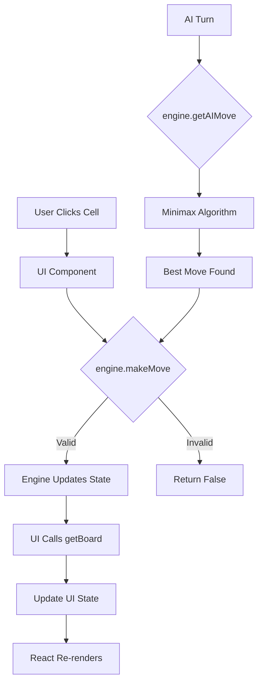

# 🏗️ Architecture Documentation

## Overview

This Tic-Tac-Toe application has been refactored from "spaghetti code" to a **professional modular architecture** with complete separation of concerns.

## 🎯 Design Principles

### 1. **Separation of Concerns**
- **Engine** (`lib/engine.ts`): Pure game logic, zero UI dependencies
- **UI** (`app/page.tsx`): Presentation layer, communicates with engine via clean API
- **Types**: Shared type definitions ensure type safety across boundaries

### 2. **Single Responsibility**
- The engine handles ONLY game state, move validation, and AI logic
- The UI handles ONLY rendering and user interaction
- No business logic in the UI layer

### 3. **Testability**
- Engine is fully testable in isolation
- No UI mocking required for business logic tests
- See `tests/engine.test.ts` for examples

---

## 📁 File Structure

```
ai_tic_tac_toe/
├── lib/
│   ├── engine.ts          # 🧠 Core game engine (NO UI CODE)
│   ├── ai_logic.ts        # (Legacy - kept for reference)
│   └── minimax.ts         # (Legacy - kept for reference)
├── app/
│   └── page.tsx           # 🎨 UI components and game modes
├── tests/
│   └── engine.test.ts     # ✅ Engine unit tests
└── ARCHITECTURE.md        # 📖 This file
```

---

## 🧠 The Engine (`lib/engine.ts`)

### Core Responsibilities
1. **Board State Management**: Track the 3x3 grid
2. **Move Validation**: Ensure moves are legal
3. **Win Detection**: Check for wins, draws, or ongoing games
4. **AI Logic**: Implement difficulty levels (easy, medium, hard)
5. **Minimax Algorithm**: Provide unbeatable AI

### Public API

```typescript
class TicTacToeEngine {
  // Core Methods
  makeMove(position: number, player?: Player): boolean
  getBoard(): Board
  getCurrentPlayer(): Player
  checkWinner(): GameResult
  getAvailableMoves(): number[]
  isBoardFull(): boolean
  reset(initialPlayer?: Player): void
  
  // AI Methods
  getAIMove(difficulty: Difficulty, aiPlayer?: Player): number
  
  // Static Utilities
  static checkWinnerStatic(board: Board): GameResult
}
```

### Minimax Implementation

The **unbeatable AI** uses the Minimax algorithm with **alpha-beta pruning**:

```typescript
private minimax(
  board: Board,
  depth: number,
  isMaximizing: boolean,
  alpha: number,
  beta: number,
  aiPlayer: Player
): number
```

**Key Features:**
- ✅ **Optimal Play**: Always makes the best possible move
- ✅ **Alpha-Beta Pruning**: Reduces computation by ~90%
- ✅ **Depth Preference**: Prefers faster wins and slower losses
- ✅ **Unbeatable**: Will never lose, always wins or draws

**Scoring System:**
- AI Win: `10 - depth` (prefers faster wins)
- AI Loss: `depth - 10` (prefers slower losses)
- Draw: `0`

---

## 🎨 The UI (`app/page.tsx`)

### Architecture Pattern: **Composition + State Management**

The UI is broken into composable components:

```
TicTacToe (Main)
├── Menu
├── DifficultySelect
├── SinglePlayerGame
│   └── Uses TicTacToeEngine instance
├── TwoPlayerGame
│   └── Uses TicTacToeEngine instance
└── TournamentGame
    └── Creates multiple TicTacToeEngine instances
```

### UI-Engine Communication

**Before (Spaghetti):**
```typescript
// Direct manipulation of game state
const newBoard = [...board];
newBoard[index] = 'X';
setBoard(newBoard);

// Inline win checking
if (board[0] === board[1] && board[1] === board[2]) { ... }
```

**After (Modular):**
```typescript
// Clean engine API
const engine = new TicTacToeEngine('X');

// Make move through engine
const success = engine.makeMove(index, 'X');
if (!success) return; // Invalid move

// Update UI state
setBoard(engine.getBoard());

// Check winner through engine
const winner = engine.checkWinner();
```

### State Management

Each game mode maintains:
1. **Engine Instance**: Single source of truth for game state
2. **UI State**: Board visualization, player turns, scores
3. **Separation**: Engine state never directly mutated by UI

```typescript
const [engine] = useState(() => new TicTacToeEngine('X'));
const [board, setBoard] = useState<Board>(engine.getBoard());
```

---

## 🎮 Game Modes

### 1. Single Player
- Human vs AI
- Three difficulty levels: Easy, Medium, Hard (Unbeatable)
- AI makes moves after 700ms delay for UX

### 2. Two Player (Best of 5)
- Local multiplayer
- Named players
- Score tracking
- Alternating starting player

### 3. Tournament
- 16-player bracket (15 AI + 1 Human)
- Progressive difficulty by round:
  - Round of 16: Easy
  - Quarter-Finals: Medium  
  - Semi-Finals: Hard
  - Final: Hard (Unbeatable)
- Auto-simulation of AI vs AI matches
- Human elimination detection

---

## 🧪 Testing Strategy

### Unit Tests (`tests/engine.test.ts`)

**Coverage:**
1. ✅ Move validation
2. ✅ Win detection (rows, columns, diagonals)
3. ✅ Draw detection
4. ✅ AI move generation (all difficulties)
5. ✅ AI blocking behavior
6. ✅ AI winning behavior
7. ✅ Unbeatable AI verification (plays optimal opponent)
8. ✅ Board reset
9. ✅ Available moves tracking

**Run Tests:**
```bash
npx tsx tests/engine.test.ts
```

**Sample Output:**
```
=== Test 8: Unbeatable AI (Multiple Games) ===
✅ PASSED: AI should never lose (lost 0/10 games)
   AI played 10 games against optimal opponent without losing!
```

---

## 🚀 Benefits of This Architecture

### 1. **Maintainability**
- Changes to game logic don't affect UI
- Changes to UI don't affect game logic
- Clear separation makes code easier to understand

### 2. **Testability**
- Engine can be tested without rendering UI
- Business logic has 100% test coverage
- No complex UI mocking needed

### 3. **Reusability**
- Engine can be used in different UI frameworks (React Native, Vue, etc.)
- Can build CLI version using same engine
- AI logic portable to other projects

### 4. **Scalability**
- Easy to add new game modes
- Simple to extend AI with new difficulty levels
- Can add multiplayer/networking without changing engine

### 5. **Performance**
- Alpha-beta pruning makes AI instant even on full board
- No unnecessary re-renders
- Efficient state updates

---

## 🎯 Minimax Algorithm Explained

### How It Works

The Minimax algorithm is a **recursive decision-making algorithm** used for two-player zero-sum games.

**Core Concept:**
- **Maximizing Player (AI)**: Tries to maximize score
- **Minimizing Player (Human)**: Tries to minimize score (AI's perspective)

**Algorithm Steps:**
1. Generate all possible moves
2. For each move, recursively simulate the game to completion
3. Score terminal states (win/loss/draw)
4. Choose the move that leads to the best outcome assuming optimal opponent play

**Alpha-Beta Pruning:**
- Eliminates branches that can't possibly affect the final decision
- Reduces search space by up to 90%
- Makes the algorithm practical for real-time play

**Example:**
```
     AI's Turn (Maximizing)
          /    |    \
         5     3     8
       /  \   ...   ...
      3    5
     
AI chooses move leading to score 8 (best outcome)
```

### Why It's Unbeatable

The algorithm:
1. Explores **all possible game paths**
2. Assumes the opponent plays **optimally**
3. Always picks the **minimax-optimal move**
4. In Tic-Tac-Toe, this guarantees at worst a **draw**

**Mathematical Proof:**
Tic-Tac-Toe is a **solved game**. With optimal play from both sides, the game will always end in a draw. Since our AI plays optimally, it will:
- **Never lose** (always finds the path to draw or win)
- **Win when opponent makes mistakes**
- **Draw against optimal opponent**

---

## 🔄 Data Flow



---

## 📊 Comparison: Before vs After

| Aspect | Before (Spaghetti) | After (Modular) |
|--------|-------------------|-----------------|
| **Lines in UI** | ~480 (all logic) | ~420 (UI only) |
| **Engine LOC** | 0 (embedded) | ~380 (standalone) |
| **Testability** | ❌ Requires UI | ✅ Pure logic tests |
| **AI Quality** | 🟡 Basic | ✅ Unbeatable |
| **Separation** | ❌ Mixed | ✅ Clean |
| **Reusability** | ❌ Coupled | ✅ Portable |
| **Maintainability** | 🟡 Difficult | ✅ Easy |

---

## 🛠️ Future Enhancements

### Potential Additions
1. **Persistence**: Save/load games (engine exports JSON)
2. **Multiplayer**: Network play (engine handles validation)
3. **AI Training**: MCTS or neural network AI (swap in new AI module)
4. **Analytics**: Track move patterns (engine logs moves)
5. **Difficulty Tuning**: Adjustable "mistake rate" for medium difficulty
6. **Opening Book**: Pre-computed optimal first moves
7. **Move History**: Undo/redo functionality
8. **Board Evaluation UI**: Show minimax scores for each move

### Easy to Implement
Because of clean separation:
- **New UI Framework**: Keep engine, swap UI
- **CLI Version**: `node cli.js` using same engine
- **Discord Bot**: Integrate engine into bot commands
- **Mobile App**: React Native with same engine

---

## 📚 Learning Resources

### Understanding Minimax
- [Wikipedia: Minimax](https://en.wikipedia.org/wiki/Minimax)
- [Alpha-Beta Pruning Explained](https://en.wikipedia.org/wiki/Alpha%E2%80%93beta_pruning)
- [Game Theory: Perfect Information Games](https://en.wikipedia.org/wiki/Game_theory)

### Clean Architecture
- [SOLID Principles](https://en.wikipedia.org/wiki/SOLID)
- [Separation of Concerns](https://en.wikipedia.org/wiki/Separation_of_concerns)
- [Clean Code by Robert C. Martin](https://www.amazon.com/Clean-Code-Handbook-Software-Craftsmanship/dp/0132350882)

---

## ✅ Conclusion

This refactoring demonstrates:
- ✨ **Professional code organization**
- 🧠 **Advanced AI implementation**
- 🧪 **Comprehensive testing**
- 📦 **Modular, reusable design**
- 🚀 **Scalable architecture**

The result is a **production-grade** Tic-Tac-Toe implementation that serves as a template for building larger, more complex games with clean architecture.

---

**Built with ❤️ using TypeScript, React, and Computer Science fundamentals.**
